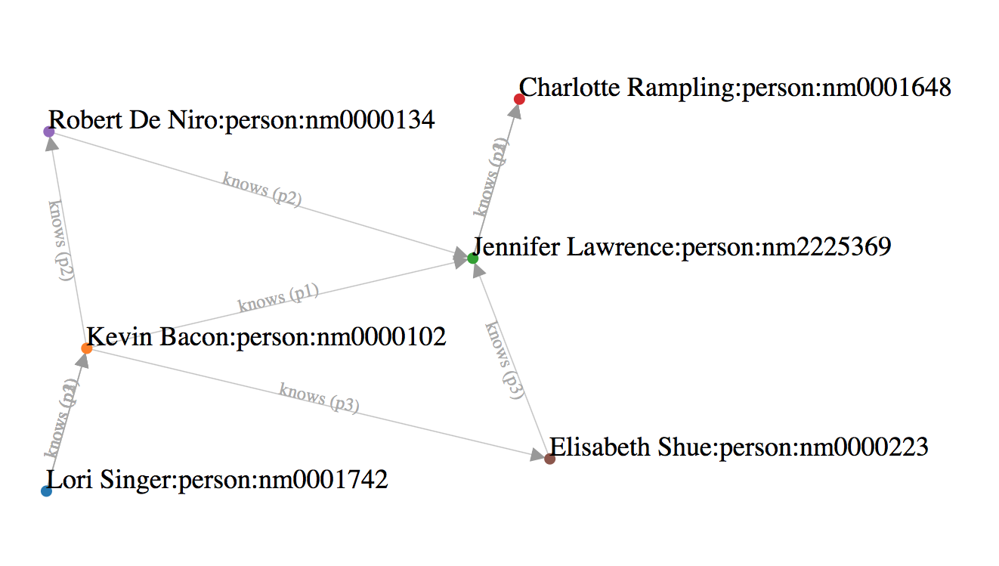

# azure-cosmosdb-graph

CosmosDB Graph Database example - the N-Degrees of Kevin Bacon (or Lori Singer or Julia Roberts or Richard Gere or ...)

Start with the IMDb datasets, wrangle them to a smaller practical size, load them into a CosmosDB/GraphDB, and search
for the n-degrees of Kevin Bacon and others.

## The Six Degrees of Kevin Bacon

This CosmosDB/GraphDB example was inspired by [this](https://en.wikipedia.org/wiki/Six_Degrees_of_Kevin_Bacon)

> "...in a January 1994 interview with Premiere magazine discussing the film The River Wild, mentioned that "he had worked
> with everybody in Hollywood or someone who’s worked with them."[1] On April 7, 1994, a lengthy newsgroup thread headed
> "Kevin Bacon is the Center of the Universe" appeared.  Four Albright College students: Craig Fass, Christian Gardner,
> Brian Turtle, and Mike Ginelli created the game early in 1994."

It rests on the assumption that anyone involved in the Hollywood film industry can be linked through their film roles
to Bacon within six steps.


## CosmosDB Provisioning

In Azure Portal, provision a CosmosDB with the Graph API.  Capture its keys in the Azure Portal, and set
these as environment variables on your system (see the 'Environment Variables' section below).

Within the DB account, create database id **dev** with graph id **movies** as shown.
It is recommended that you specify 10,000 RUs.


For best performance is strongly recommended that you configure your graphs with a **partition key** per
[this article](https://docs.microsoft.com/en-us/azure/cosmos-db/partition-data).  Choose a generic name
like "pk" or "pkey", but populated it with many unique values.  It's a best practice to have a partition key
with many distinct values (hundreds to thousands at a minimum).

## This Project

This project contains **both** the data-wrangling logic as well as the end-result data
that you can simply use.

At this time (3/14/2018) these instructions and scripts are oriented toward either of the
following two environments:
- "Standard" Python 3.6.4 from Python.org running on **macOS**.
- Anaconda Python Python 3.5.2 on an **Azure Ubuntu Data Science Virtual Machine (DSVM)**.

The several bash scripts in this project which use Python should auto-detect the operating
system (Linux or macOS) and set the appropriate Python virtual environment.

Docker containerized and/or Windows support may be added in the future.

### Programming Languages

This project uses both Python and Java as follows:

- Python 3.x is used for **wrangling** the IMDb data into smaller files in the data/processed/ directory.
- Java 8 is used to **load** the Azure CosmosDB Graph database from file **data/processed/load_queries.txt**
- Python 3.x is also used for command-line queries of the database, and for creating the visualizations.

### macOS

On macOS, to clone the project and setup your Python virtual environment, run the following in Terminal.
It is assumed that git, Python 3.5 or higher, Java 8, and Maven are installed.
```
$ git clone git@github.com:cjoakim/azure-cosmosdb-graph.git
$ cd azure-cosmosdb-graph
$ mkdir tmp/
$ ./venv.sh
$ source bin/activate
$ python --version
Python 3.6.4
```

### DSVM

The setup instructions for an Azure Ubuntu Data Science Virtual Machine are very similar.
The DSVM includes git, Anaconda Python 3.5, Java 8, and Maven.
```
$ git clone git@github.com:cjoakim/azure-cosmosdb-graph.git
$ cd azure-cosmosdb-graph
$ mkdir tmp/
$ ./conda_env_dsvm.sh
$ source activate gremlin
$ python --version
Python 3.5.2 :: Anaconda custom (64-bit)
```

You can optionally enable port 8899 on the DSVM for use by the lightwight Python web server
to serve D3.js visualizations.  In Azure Portal, select your DSVM, click 'Networking' then
add an inbound port rule.  See section "Visualizations with D3.js" below.

### Environment Variables

In either environment, you'll need to set the following environment variables to similar values:

```
AZURE_COSMOSDB_GRAPH1_ACCT=cjoakim-cosmos-graph1
AZURE_COSMOSDB_GRAPH1_CONN_STRING=AccountEndpoint=https://cjoakim-cosmos-graph1.documents.azure.com:443/;AccountKey=h2D...Sw==;
AZURE_COSMOSDB_GRAPH1_DBNAME=dev
AZURE_COSMOSDB_GRAPH1_KEY=h2D...Sw==
AZURE_COSMOSDB_GRAPH1_URI=https://cjoakim-cosmos-graph1.documents.azure.com:443/

IMDB_DATA_DIR=<some directory on your computer>
```

The IMDB_DATA_DIR environment variable is used by the code to locate the necessary data files.
It is recommended that you set it to the path to the **data/** subdirectory within this project.

### Data Wrangling

**To simply use the pre-wrangled data, skip down to the "Load the Database" section below.**

The source data for this project is the **Internet Movie Database (IMDb)**.  It contains millions of rows
of data related to Hollywood moves, their actors/participants, and their ratings.

This data can be downloaded from here:
- http://www.imdb.com/interfaces/
- https://datasets.imdbws.com

The wrangling logic in this project filters this huge amount of data into a small subset that
is easily loaded into CosmosDB for your exploration.  The wrangling logic is implemented in Python 3.

In short, the wrangling steps are:
- Start with a manually created list of just 10 favorite actors (see 'actors_for_candidate_movies' below)
- Extract just the movies for those actors
- Filter the movies by minimum rating
- Extract the principals (i.e. - actors) for those filtered movies.  Omit directors, producers, stunt men, etc.
- Extract the details for each of the principals
- Derive the person-knows-person Edges based on the set of actors for each movie
- Generate a list of Gremlin commands to insert the Vertices (movies, actors) and Edges into the DB

See bash shell scripts **wrangle.sh** and **create_load_queries.sh** which implement this process.
Note that the Gremlin command generation was intentionally decoupled from the actual DB loading process.

Within $IMDB_DATA_DIR there should be raw/ and processed/ subdirectories.  The downloaded
and unzipped IMDb data should be in the raw/ directory.

This is the list of the 10 actors as Python code:
```
    def actors_for_candidate_movies(self):
        # This set of actors drives the selection of movies in the IMDb data-wrangling process.
        actors = dict()
        actors['nm0000102'] = 'kevin_bacon'
        actors['nm0000113'] = 'sandra_bullock'
        actors['nm0000126'] = 'kevin_costner'
        actors['nm0000152'] = 'richard_gere'
        actors['nm0000158'] = 'tom_hanks'
        actors['nm0000206'] = 'keanu_reeves'
        actors['nm0000210'] = 'julia_roberts'
        actors['nm0000234'] = 'charlize_theron'
        actors['nm1297015'] = 'emma_stone'
        actors['nm2225369'] = 'jennifer_lawrence'
        return actors
```

### Load the Database

File **data/processed/load_queries.txt** contains the pre-wrangled data that
you can simply load into your DB.  It contains 7149 Gremlin commands to insert the
set of **Vertices** (i.e. - movies and people) and the **Edges** connecting them.

To load this data into your dev/movies DB, execute the following bash script:
```
$ ./execute_load_queries.sh
```

This process will take approximately an 10-minutes, as there is a built in sleep time between
inserts.  1284 Vertices should be inserted (426 movies, 858 people), with 5865 Edges.

### Query the Database

The following are example Gremlin queries.  These can either be executed within the Azure Portal
or with the Python client.

```
count the vertices:
g.V().count()

diane_lane_edges:
g.V('nm0000178').bothE()

diane_lane_in:
g.V('nm0000178').out('in')

diane_lane_knows:
g.V('nm0000178').out('knows')

julia_roberts_edges:
g.V('nm0000210').bothE()

julia_roberts_in:
g.V('nm0000210').out('in')

julia_roberts_knows:
g.V('nm0000210').out('knows')

kevin_bacon_edges:
g.V('nm0000102').bothE()

kevin_bacon_in:
g.V('nm0000102').out('in')

kevin_bacon_knows:
g.V('nm0000102').out('knows')

lori_singer_edges:
g.V('nm0001742').bothE()

lori_singer_in:
g.V('nm0001742').out('in')

lori_singer_knows:
g.V('nm0001742').out('knows')

movie_footloose:
g.V().has('label','movie').has('id','tt0087277')

movie_pretty_woman:
g.V().has('label','movie').has('id','tt0100405')

person_julia_roberts:
g.V().has('label','person').has('id','nm0000210')

person_kevin_bacon:
g.V().has('label','person').has('id','nm0000102')

person_nm0001742:
g.V().has('label','person').has('id','nm0001742')

person_richard_gere:
g.V().has('label','person').has('id','nm0000152')

richard_gere_edges:
g.V('nm0000152').bothE()

richard_gere_in:
g.V('nm0000152').out('in')

richard_gere_knows:
g.V('nm0000152').out('knows')

-- Path Queries

path_richard_gere_to_julia_roberts:
g.V('nm0000152').repeat(out().simplePath()).until(hasId('nm0000210')).path().limit(3)

path_richard_gere_to_kevin_bacon:
g.V('nm0000152').repeat(out().simplePath()).until(hasId('nm0000102')).path().limit(3)

path_richard_gere_to_lori_singer:
g.V('nm0000152').repeat(out().simplePath()).until(hasId('nm0001742')).path().limit(3)

path_diane_lane_to_lori_singer:
g.V('nm0000178').repeat(out().simplePath()).until(hasId('nm0001742')).path().limit(3)
```

See file queries.sh.  These previously executed queries have been captured to files in the
queries/ directory in this project.

## Visualizations with D3.js

You can start a local python web server by running the command below:
```
$ source bin/activate
$ ./webserver.sh
```
### Example 1

In another Terminal window, execute the following command to query CosmosDB for the "knows"
path from Lori Singer (actress in Footloose) to Charlotte Rampling (actress in Red Sparrow).
```
$ python cosmos_graph.py query $dbname $collname path lori_singer charlotte_rampling
```

The above command creates and executes the following Gremlin query, after translating
the person names to their IMDb identifiers.
```
g.V('nm0001742').repeat(out().simplePath()).until(hasId('nm0001648')).path().limit(3)
```

The visit **http://localhost:8899/d3/index.html** with your web browser.  You should be able
to see a D3.js visualization of your latest path query.  For example, the "knows" path from
Lori Singer to Charlotte Rampling is shown below.



### Example 2

Can you guess who nm0000206 is based on what movies they are "in" ?
```
$ python cosmos_graph.py query $dbname $collname in nm0000206
```


## Gremlin-Python and Apache TinkerPop

Apache TinkerPop is a graph computing framework for both graph databases (OLTP)
and graph analytic systems (OLAP).  CosmosDB uses the Gremlin API, and the Python code
in this project accesses Gremlin via the **gremlinpython** library, version 3.2.7.

Here are some useful links to Apache TinkerPop and Gremlin:
- http://tinkerpop.apache.org
- http://tinkerpop.apache.org/docs/3.2.7/recipes/
- http://tinkerpop.apache.org/docs/current/reference/#gremlin-python
- https://pypi.python.org/pypi/gremlinpython/3.2.7
- https://docs.microsoft.com/en-us/azure/cosmos-db/create-graph-gremlin-console

## Notes

```
IMDb Identifiers:

    Kevin Bacon        = nm0000102
    Lori Singer        = nm0001742
    Viola Davis        = nm0205626
    Charlotte Rampling = nm0001648
    Footloose          = tt0087277

Gremlin Insert Statements:

    g.addV('movie').property('id', 'tt0087277').property('title', 'Footloose')

    g.addV('person').property('id', 'nm0000102').property('name', 'Kevin Bacon')
    g.addV('person').property('id', 'nm0001742').property('name', 'Lori Singer')

    g.V('nm0000102').addE('in').to(g.V('tt0087277')).property('title', 'Footloose')
    g.V('nm0001742').addE('in').to(g.V('tt0087277')).property('title', 'Footloose')

    g.V('nm0000102').addE('knows').to(g.V('nm0001742')).property('mid_list', 'tt0087277')
    g.V('nm0001742').addE('knows').to(g.V('nm0000102')).property('mid_list', 'tt0087277')

Gremlin Queries and Python equivalents:

    Count the Vertices:
        g.V().count()
        python cosmos_graph.py query $dbname $collname countv

    Search the movie Footloose:
        g.V().has('label','movie').has('id','tt0087277')
        python cosmos_graph.py query $dbname $collname movie footloose

    Who does Kevin Bacon know?
        g.V('nm0000102').out('knows')
        python cosmos_graph.py query $dbname $collname knows kevin_bacon

    What are the "knows" paths from Lori Singer to Viola Davis?
        g.V('nm0001742').repeat(out().simplePath()).until(hasId('nm0205626')).path().limit(3))
        python cosmos_graph.py query $dbname $collname path lori_singer viola_davis

    What are the "knows" paths from Lori Singer to Charlotte Rampling?
        g.V('nm0001742').repeat(out().simplePath()).until(hasId('nm0001648')).path().limit(3)
        python cosmos_graph.py query $dbname $collname path lori_singer charlotte_rampling
```

## Partitioning

For example, for a graph with region ("USA") as the partition key and "Seattle" as the row key,
you can find a vertex by using the following syntax:
g.V(['USA', 'Seattle'])
g.V([<partitionkey>, <rowkey>])
g.E(['USA', 'I5'])

https://docs.microsoft.com/en-us/azure/cosmos-db/partition-data
"It's a best practice to have a partition key with many distinct values (hundreds to thousands at a minimum)."
